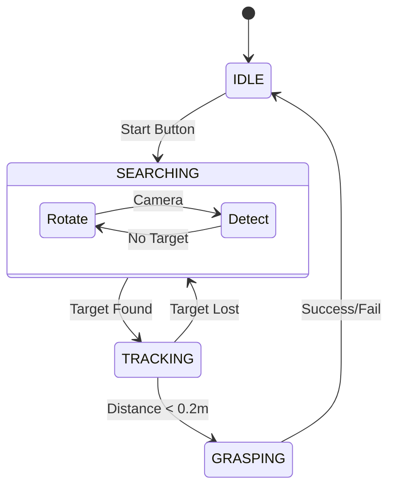

# BaseHandler: 状态机与调度

`BaseHandler` 是业务逻辑的编排者。它通常实现为一个**有限状态机 (FSM)**，负责根据系统的当前状态，指挥 Node 收集数据，指挥 Agent 处理数据，最后决定下一步做什么。

## 1. 为什么需要 Handler?

在简单的 ROS 节点中，逻辑通常散落在各个 Callback 回调函数里。一旦系统变复杂，回调嵌套就会变成“回调地狱”。

Handler 将所有逻辑收敛到一个清晰的 `handle()` 循环中，由 Manager 的定时器周期性驱动。

## 2. 状态机设计 (FSM)

比如一个机器人搜索检测网球，并拾起的状态机：



### 代码示例

```python
from enum import Enum, auto
from ros_base.handlers.base_handlers import BaseHandlers

class RobotState(Enum):
    IDLE = auto()      # 待机
    SEARCHING = auto() # 搜索目标
    TRACKING = auto()  # 跟踪靠近
    GRASPING = auto()  # 执行抓取

class MyHandler(BaseHandlers):
    def __init__(self, *args, **kwargs):
        super().__init__(*args, **kwargs)
        self.current_state = RobotState.IDLE
        self.prev_state = None
        
        # 获取资源引用
        self.camera = self.nodes['camera']
        self.vision_agent = self.agents['vision']

    def handle(self):
        # --- 1.处理状态跳转逻辑 (Transitions) --- 
        if self.current_state != self.prev_state:
            self.logger.info(f"State: {self.prev_state} -> {self.current_state}")
            self.on_state_enter(self.current_state)
            self.prev_state = self.current_state

        # --- 2. 状态循环逻辑 (Loop) ---
        if self.current_state == RobotState.IDLE:
            if self.check_start_button():
                self.current_state = RobotState.SEARCHING
                
        elif self.current_state == RobotState.SEARCHING:
            # 调用 Agent 计算
            target = self.vision_agent.detect(self.camera.img)
            
            if target:
                self.current_state = RobotState.TRACKING
            else:
                self.publish_search_cmd()

    def on_state_enter(self, state):
        if state == RobotState.SEARCHING:
            self.nodes['head'].look_up()
```

## 3. 核心设计模式

### 3.1 状态保持 vs 状态切换
*   **Loop (循环部分)**: 放在 `if state == ...` 中。例如 PID 跟踪控制，需要每帧都跑。
*   **Transition (切换部分)**: 放在 `if current != prev` 中。例如“打开夹爪”、“切换模型”。动作只需做一次。

### 3.2 资源调度
Handler 的一个重要作用是**按需分配算力**。

*   在 `IDLE` 状态：不需要调用昂贵的 `VisionAgent`。
*   在 `TRACKING` 状态：高频调用 `TrackingAgent`。
*   在 `DECIDING` 状态：调用一次大模型 Agent。
