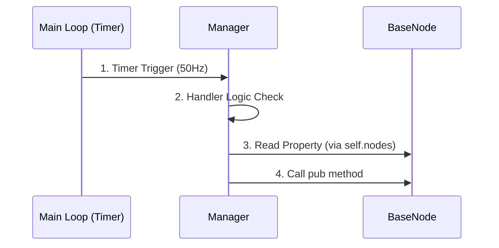
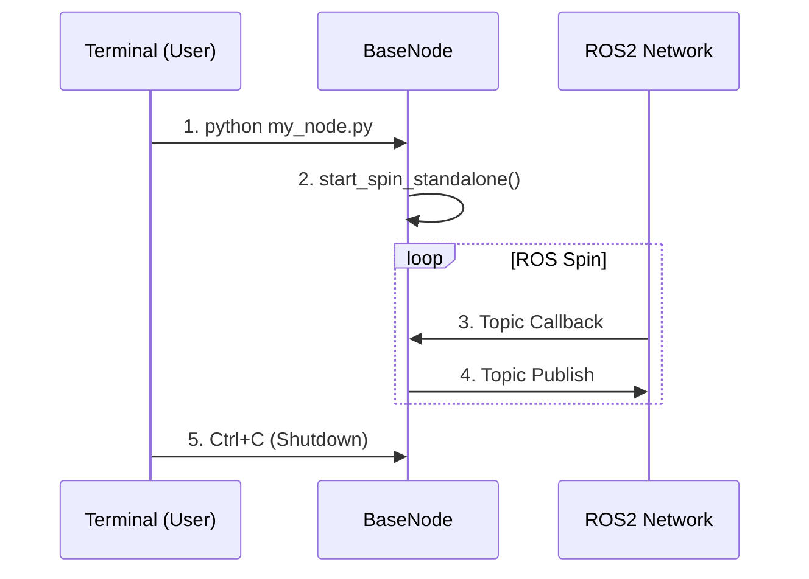

# BaseNode: 双模态节点

`BaseNode` 是 `ros_base` 中所有与 ROS 通信相关模块的基类。它最独特的设计在于**双模态 (Dual-Mode)**：既可以作为系统的一部分依附运行，也可以独立作为标准 ROS 节点启动。

## 1. 双模态设计示意

我们通过一张简单的时序图来对比两种模式下 `BaseNode` 的行为差异。

### 依附模式 (Attached Mode)

这通常是生产环境的运行方式。



### 独立模式 (Standalone Mode)

这通常用于调试驱动或单独测试通信。



## 2. 编写一个 BaseNode

所有的 Node 都应继承自 `ros_base.nodes.base_node.BaseNode`。

### 代码模板

```python
from ros_base.nodes.base_node import BaseNode
from sensor_msgs.msg import Image

class MyCameraNode(BaseNode):
    def __init__(self, *args, **kwargs):
        super().__init__(*args, **kwargs)
        
        # 定义数据缓存 (用于依附模式)
        self.latest_image = None
        
        # 创建发布者/订阅者
        self.sub = self.create_subscription(
            Image, '/camera/rgb', self.callback, 10
        )

    def callback(self, msg):
        # 1. 更新缓存 (给 Manager 和 Agent 用)
        self.latest_image = msg
```

### 关键点解析
1.  **统一 API**: `BaseNode` 封装了 `create_publisher`, `create_timer` 等常用方法。
    *   在依附模式下，它们调用的是 `Manager.create_publisher`。
    *   在独立模式下，它们调用的是内部临时 Node 的方法。
2.  **start_spin_standalone()**: 这是独立运行的魔法函数。它会自动创建一个 ROS 上下文并开始 Spin，直到收到 `Ctrl+C`。

## 3. 依附模式下的 Bridge 作用

在复杂系统中（如大小脑架构），Node 往往充当 **Bridge (桥梁)** 的角色。


Agent 不需要关心底层的通信协议，只管调用 Node 的方法即可。

```python
class Robot2VLMBridge(BaseNode):
    def send_command(self, vx, vy, wz):
        msg = Twist()
        msg.linear.x = vx
        self.pub_cmd.publish(msg)
```
