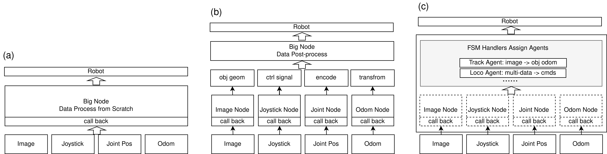

# ROS Base Project

**ROS Base** is a standardized application framework designated for complex robot systems based on ROS2 (Python).

By introducing the **Manager-Node-Agent-Handler** layered architecture, it resolves the conflict between "Monolithic Big Node" and "Loose Multi-process" paradigms in traditional ROS development, providing a **high-cohesion, low-coupling, and plugin-extensible** development standard.

---

## Why ROS Base?

When developing large-scale robot systems involving task planning, locomotion control, SLAM, and object detection, architects often face a dilemma:

### 1. Pain Points of Traditional Approaches

=== "Scenario A: The Big Node (Monolithic)"

    Writing all functionalities (subscription, preprocessing, computation, publishing) into one gigantic Class.
    
    *   **:white_check_mark: Pros**: Direct memory access for data, ultra-low latency.
    *   **:x: Cons**: 
        *   **High Coupling**: Changes in one part affect the whole system. Hard to maintain.
        *   **Hard to Test**: To test a "vision algorithm," you are forced to launch the entire "locomotion system."
        *   **Low Reusability**: Code is tightly bound to a specific project.

=== "Scenario B: Micro-services (Multi-process)"

    Splitting every feature into independent ROS Node processes.
    
    *   **:white_check_mark: Pros**: Physical isolation of modules, thorough decoupling.
    *   **:x: Cons**: 
        *   **Cumbersome Startup**: Requires maintaining long Launch files or opening multiple terminals.
        *   **Communication Overhead**: Inter-process data exchange requires serialization (Topic), adding latency.
        *   **Complex Coordination**: Handshakes, state synchronization, and parameter configuration between nodes become messy.

### 2. The ROS Base Solution

**ROS Base adopts "Scenario C": Manager-based Intra-process Decoupling.**



We introduce a core concept —— **BaseManager**:

1.  **Attached Operation**: 
    *   All sub-nodes (Nodes) and algorithm modules (Agents) are registered into the Manager.
    *   They appear as a single ROS Node externally but share memory data internally via `self` attributes (solving communication overhead).
2.  **Dual-Mode Design**:
    *   Every **BaseNode** can run attached within a Manager OR **start independently as a standard ROS2 Node** at any time (solving testing difficulties).
3.  **Separation of Concerns**:
    *   **Node**: Handles data I/O only.
    *   **Agent**: Handles algorithm computation only.
    *   **Handler**: Handles business logic and FSM only.
    *   **Manager**: Manages the lifecycle of everything.

---

## Key Features

*   **⚡ High Performance**: Supports multi-process mounting (`register_multiprocess_nodes`) to easily isolate CPU-intensive tasks (e.g., camera capture).
*   **🧩 Reusable**: Comes with out-of-the-box camera wrappers (`CamSubNode`), visualization modules (`Overlay`), and math utilities.
*   **🩺 Debug Friendly**: Built-in `profile_latency` decorators and unified logging system make performance bottlenecks visible.
*   **🤖 Field Proven**: Stably running in **HomiQuad-VLM** (Brain-Cerebellum synergy) and **Quad-Deploy** (RL Locomotion) projects.

## Quick Start

Install via command line:

```bash
git clone https://github.com/11chens/ros_base.git
cd ros_base
pip install -e .
```

Next, read the [**Quick Start**](quick-start/installation.md) guide.
