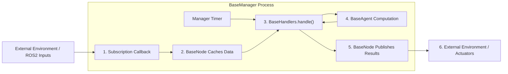
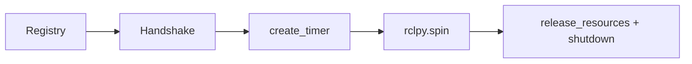

<!-- i18n-sync: source=docs/quick-start/architecture.md; sha256=A6538D3871B7465C532ECD30D32FE54DC1495042C5C0069FB471799F32F1B036 -->
# Architecture Overview

ROS Base splits a robot application into four fixed roles:

- `BaseManager`: lifecycle and main loop
- `BaseNode`: communication and data caching
- `BaseAgent`: algorithms and computation
- `BaseHandlers`: scheduling and state machines

The key idea is this: **in attached mode, nodes and agents are registered into the same manager and share one ROS main-process context.**



---

## 1. The actual relationships in code

### `BaseManager`

`BaseManager` directly inherits `rclpy.node.Node`, so it is the object that actually participates in ROS2 spinning. During construction it performs three registrations:

1. Register `nodes_dict`
2. Register `agents_dict`
3. Register `handlers_class`

During registration, the manager passes itself to each object through `manager=self`.

### `BaseNode`

`BaseNode` is not itself a `Node` subclass. It is a wrapper layer:

- When `manager` exists, methods such as `create_subscription()` are forwarded to the manager.
- When `manager` is absent, it creates and owns a temporary `rclpy.node.Node`.

That is where the dual-mode behavior comes from.

### `BaseAgent`

`BaseAgent` does not create publishers or subscriptions. Its focus is computation and internal state. After registration into a manager, it can access context through:

- `self.nodes`
- `self.agents`
- `self.state`
- `self.timestamp`

### `BaseHandlers`

`BaseHandlers.handle()` is the default business entry point inside the main loop. It can either:

- Maintain its own internal state machine
- Or read and write `manager.state` directly through `self.state`

Both styles are used in the current example repositories.

---

## 2. What happens after startup



### Stage 1: Registry

Inside `BaseManager.__init__()`:

```
super().__init__(
    node_name="PickPlaceOrchestrator",
    nodes_dict=nodes_dict,
    agents_dict=agents_dict,
    handlers_class=PickPlaceFSMHandlers,
    node_freq_hz=10,
)
```

The manager instantiates each component in sequence:

```
self.nodes[node_name] = node_class(manager=self, *args, **kwargs)
self.agents[agent_name] = agent_class(manager=self, *args, **kwargs)
self.handlers = handlers_class(manager=self, *args, **kwargs)
```

### Stage 2: Handshake

Before creating the timer, `start_main_loop_timer()` repeatedly checks handshake rules:

```
self.add_handshake_rule("Camera Stream", lambda: self.nodes["camera"].img is not None)
```

As long as any condition is not satisfied, the manager keeps calling `spin_once(self, timeout_sec=0.1)` until external messages provide the required data.

### Stage 3: Main loop

After the handshake passes, the manager creates a fixed-rate timer and runs the following sequence inside `main_loop()`:

1. Optional manager-level state transitions
2. `handlers.handle()`
3. `timestamp += 1`
4. Optional frequency logging

### Stage 4: Shutdown

`start_main_loop_timer()` also handles the full shutdown sequence:

- Stop child processes
- Call `release_resources()`
- Call `destroy_node()`
- Call `rclpy.shutdown()`

Because of that, it is usually **not** recommended to call `rclpy.spin(manager)` again from outside.

---

## 3. Two common state-machine styles

### Style A: the handler owns a fine-grained FSM

`SigLoMa-VLM` uses this pattern:

- `manager.state` stores only a coarse state or the startup state
- `PickPlaceFSMHandlers` maintains `current_state` and `prev_state` internally

Advantages:

- State definitions can be more fine-grained
- It fits task-oriented FSMs well

### Style B: the handler directly drives `manager.state`

`quad_deploy` uses this pattern:

- `self.state` maps directly to `manager.state`
- State values are global strings such as `"cold_start"`, `"turn"`, and `"navigation"`

Advantages:

- Global state stays centralized
- It fits control-state switching and cross-module broadcasting well

---

## 4. When to split into multiple processes

ROS Base does not require everything to stay inside one manager.

Good candidates to keep inside the same manager:

- High-frequency shared context
- Lightweight callback caches
- Business flows that need to read and write the same state directly

Good candidates to move into separate processes:

- Camera SDKs or blocking external commands
- Heavy computation that holds the GIL for long periods
- External toolchains that should not disturb the main control loop
