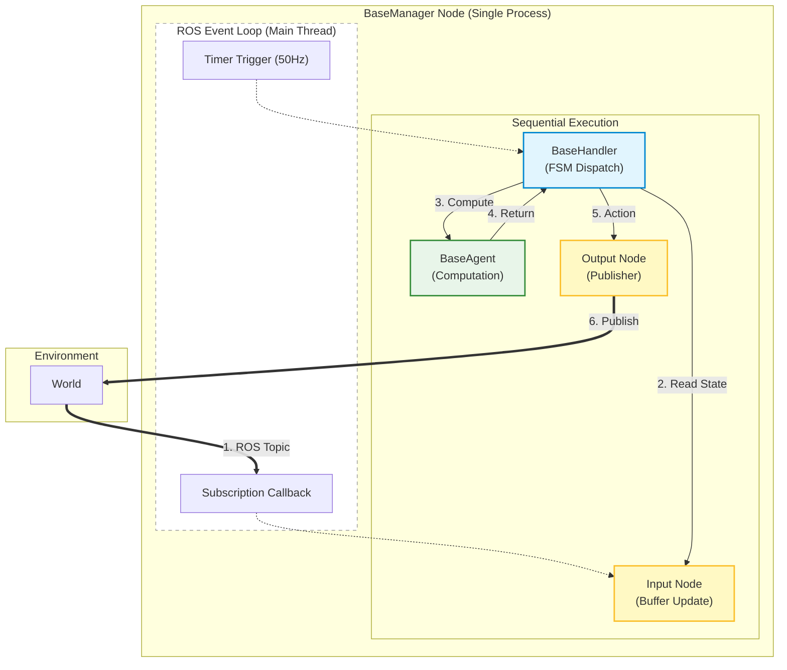
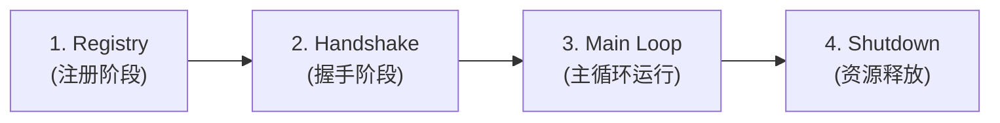

# 核心架构全景

ROS Base 将一个复杂的机器人系统解构为四个标准化的核心元素：**Manager**、**Node**、**Agent** 和 **Handler**。它们在单线程事件循环中高效协作：




---

## 1. 核心组件详解与示例

### 🕵️ BaseManager (系统管家)

`BaseManager` 是系统的主进程入口，也是唯一的 ROS Node。它像一个容器，容纳了所有的组件。

```python
class MyManager(BaseManager):
    def __init__(self):
        # 1. 注册组件字典
        super().__init__(
            nodes_dict={"sensor": SensorNode}, 
            agents_dict={"algo": AlgorithmAgent}, 
            handlers_class=LogicHandler
        )
        # 2. 启动 50Hz 主循环
        self.start_main_loop_timer(50)
```

### 🔌 BaseNode (通信接口)

`BaseNode` 负责将外部的 ROS 消息“搬运”到 Manager 的内存中，或者将内存中的指令“搬运”出去。

```python
class SensorNode(BaseNode):
    def callback(self, msg):
        # 关键点：直接把数据挂到 self 上，供 Manager 随时访问
        # 不再需要通过 Topic 转发给内部模块
        self.latest_msg = msg
```

### 🧠 BaseAgent (算力核心)

`BaseAgent` 是纯粹的函数式计算单元。它不关心数据从哪里来，只关心输入和输出。

```python
class AlgorithmAgent(BaseAgent):
    def inference(self, input_data):
        # 纯计算，无 ROS 依赖，方便单独测试
        result = self.model.process(input_data)
        return result
```

### 🚦 BaseHandler (业务调度)

`BaseHandler` 是每帧被自动调用的逻辑中枢。

```python
class LogicHandler(BaseHandlers):
    def handle(self):
        # 1. 从 Node 读取数据 (Zero-Copy)
        data = self.nodes['sensor'].latest_msg
        
        # 2. 调用 Agent 计算
        if data is not None:
            res = self.agents['algo'].inference(data)
            
        # 3. 通过 Node 发布指令
        self.nodes['actuator'].publish_cmd(res)
```

---

## 2. 系统运行流水线 (Pipeline)

一个基于 ros_base 的程序启动后，会严格经历以下四个阶段。以下代码展示了框架内部的核心实现逻辑：



### 阶段 1: Registry (注册)

在初始化阶段，Manager 会遍历用户提供的字典，实例化所有对象，并注入 `self.manager` 引用，建立“星形连接”。

```python
# BaseManager 内部实现逻辑
def _register_components(self, nodes_dict, agents_dict):
    # 实例化每一个 Node
    for name, node_cls in nodes_dict.items():
        node_instance = node_cls()
        # 关键：注入 Manager 引用，打通上下文
        node_instance.setup(manager=self)
        self.nodes[name] = node_instance
        
    # 实例化每一个 Agent
    for name, agent_cls in agents_dict.items():
        agent_instance = agent_cls()
        agent_instance.setup(manager=self)
        self.agents[name] = agent_instance
```

### 阶段 2: Handshake (握手)

为了防止系统在传感器未就绪时空转报错，Manager 通过 `_handshake_rules` 进行阻塞检查。

```python
# 用户代码：定义规则
self.add_handshake_rule("Lidar Ready", lambda: self.nodes['lidar'].scan is not None)

# BaseManager 内部实现逻辑
def _check_handshake(self):
    for name, rule_func in self._handshake_rules.items():
        if not rule_func():
            self.get_logger().warn(f"Waiting for: {name}...")
            return False
    return True
```

### 阶段 3: Main Loop (主循环)

这是系统的心脏。握手通过后，定时器会以固定频率（如 50Hz）调用 Handler。

```python
# BaseManager 内部实现逻辑
def _main_loop_callback(self):
    # 1. 首先检查握手状态
    if not self._handshake_passed:
        if self._check_handshake():
            self._handshake_passed = True
            self.get_logger().info("System Started!")
        return

    # 2. 执行核心业务逻辑
    try:
        # 这里调用用户的 Handler.handle()
        self.handlers.handle()
    except Exception as e:
        self.get_logger().error(f"Error in main loop: {e}")
```

### 阶段 4: Shutdown (退出)

当程序接收到 `SIGINT (Ctrl+C)` 时，框架会按顺序释放资源，防止僵尸进程或硬件未复位。

```python
# BaseManager 内部实现逻辑
def release_resources(self):
    self.get_logger().info("Shutting down...")
    
    # 倒序关闭，防止依赖问题
    if self.handlers:
        self.handlers.stop()
        
    for agent in self.agents.values():
        agent.release()
        
    for node in self.nodes.values():
        node.release()
```
