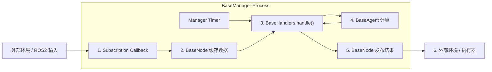
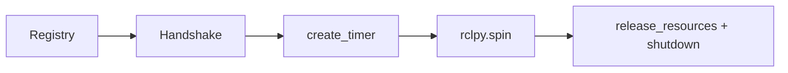

# 核心架构全景

ROS Base 把一个机器人程序拆成四个固定角色：

- `BaseManager`: 生命周期和主循环
- `BaseNode`: 通信与数据缓存
- `BaseAgent`: 算法与计算
- `BaseHandlers`: 调度与状态机

最关键的一点是：**在依附模式下，Node 和 Agent 都注册到同一个 Manager 上，共享同一个 ROS 主进程上下文。**



---

## 1. 代码里的真实关系

### `BaseManager`

`BaseManager` 直接继承 `rclpy.node.Node`，是真正参与 ROS2 spin 的对象。构造时会完成三件事：

1. 注册 `nodes_dict`
2. 注册 `agents_dict`
3. 注册 `handlers_class`

注册时，Manager 会把自己作为 `manager=self` 传给这些对象。

### `BaseNode`

`BaseNode` 本身不是 `Node` 子类，而是一个代理包装层：

- 有 `manager` 时，`create_subscription()` 等接口都转发给 Manager
- 无 `manager` 时，会自己持有一个临时 `rclpy.node.Node`

这就是“双模态”的来源。

### `BaseAgent`

`BaseAgent` 不创建 pub/sub，重点是计算与状态维护。被注册到 Manager 后，可以通过：

- `self.nodes`
- `self.agents`
- `self.state`
- `self.timestamp`

读取上下文。

### `BaseHandlers`

`BaseHandlers.handle()` 是主循环里默认的业务入口。它既可以：

- 自己维护一套内部状态机
- 也可以通过 `self.state` 直接读写 `manager.state`

这两种写法在现有示例仓里都能看到。

---

## 2. 程序启动后会经历什么



### 阶段 1: Registry

在 `BaseManager.__init__()` 中：

```
super().__init__(
    node_name="PickPlaceOrchestrator",
    nodes_dict=nodes_dict,
    agents_dict=agents_dict,
    handlers_class=PickPlaceFSMHandlers,
    node_freq_hz=10,
)
```

Manager 会依次实例化：

```
self.nodes[node_name] = node_class(manager=self, *args, **kwargs)
self.agents[agent_name] = agent_class(manager=self, *args, **kwargs)
self.handlers = handlers_class(manager=self, *args, **kwargs)
```

### 阶段 2: Handshake

`start_main_loop_timer()` 在真正创建 timer 之前，会先循环执行握手检查：

```
self.add_handshake_rule("Camera Stream", lambda: self.nodes["camera"].img is not None)
```

只要有任何条件未满足，Manager 就会持续 `spin_once(self, timeout_sec=0.1)`，直到外部消息把条件喂满。

### 阶段 3: Main Loop

握手通过后，Manager 创建固定频率的 timer，并在 `main_loop()` 里执行：

1. 可选的 manager 级状态切换
2. `handlers.handle()`
3. `timestamp += 1`
4. 可选频率日志

### 阶段 4: Shutdown

`start_main_loop_timer()` 自己负责完整的收尾流程：

- 关闭子进程
- 调用 `release_resources()`
- `destroy_node()`
- `rclpy.shutdown()`

所以一般**不要**在外面再手动 `rclpy.spin(manager)`。

---

## 3. 两种常见状态机写法

### 写法 A: Handler 自己维护细粒度状态

`SigLoMa-VLM` 使用这种方式：

- `manager.state` 只保存大级别状态或启动态
- `PickPlaceFSMHandlers` 里自己维护 `current_state` / `prev_state`

优点：

- 状态定义可以更细
- 更适合任务型 FSM

### 写法 B: Handler 直接驱动 `manager.state`

`quad_deploy` 使用这种方式：

- `self.state` 直接映射到 `manager.state`
- 状态值是 `"cold_start"`, `"turn"`, `"navigation"` 这类全局字符串

优点：

- 全局状态更集中
- 更适合控制态切换和跨模块广播

---

## 4. 什么时候要拆多进程

ROS Base 并不是要求所有东西都塞进一个 Manager。

建议留在同一 Manager 内：

- 高频共享上下文
- 轻量回调缓存
- 需要直接读写同一份状态的业务流

建议拆到独立进程：

- 相机 SDK 或阻塞型外部命令
- 会长期占住 GIL 的重计算
- 不适合污染主控制循环的外部工具链
